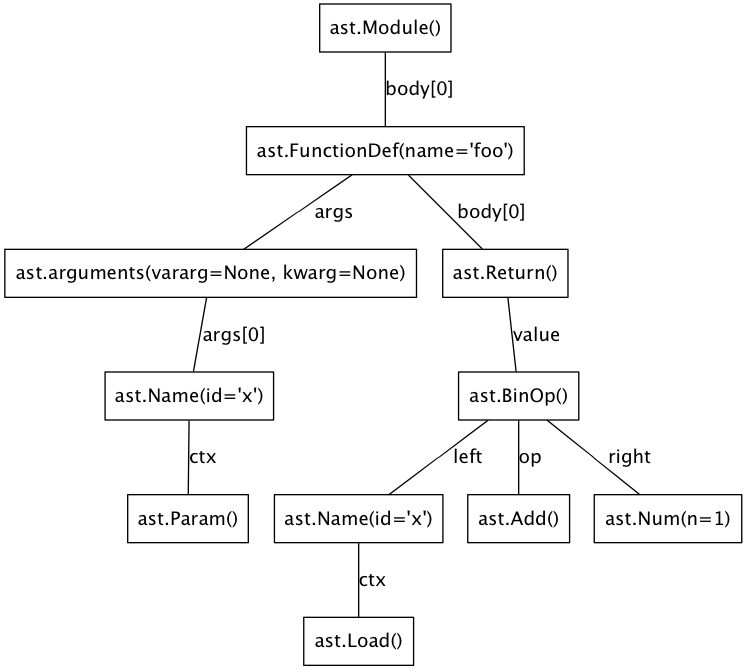

=========
astmonkey
=========

|Python Versions| |Build Status|

``astmonkey`` is a set of tools to play with Python AST.

Installation
------------

You can install ``astmonkey`` from PyPI:

::

    $ pip install astmonkey

If you want to have latest changes you should clone this repository and use ``setup.py``:

::

    $ git clone https://github.com/mutpy/astmonkey.git
    $ cd astmonkey
    $ python setup.py install

transformers.ParentNodeTransformer
----------------------------------

This transformer adds few fields to every node in AST:

* ``parent`` - link to parent node,
* ``parents`` - list of all parents (only ``ast.expr_context`` nodes have more than one parent node, in other causes this is one-element list),
* ``parent_field`` - name of field in parent node including child node,
* ``parent_field_index`` - parent node field index, if it is a list.

Example usage:

::
    
    import ast
    from astmonkey import transformers

    node = ast.parse('x = 1')
    node = transformers.ParentNodeTransformer().visit(node)

    assert(node == node.body[0].parent)
    assert(node.body[0].parent_field == 'body')
    assert(node.body[0].parent_field_index == 0)

visitors.GraphNodeVisitor
-------------------------

This visitor creates Graphviz graph from Python AST (via ``pydot``). Before you use 
``GraphNodeVisitor`` you need to add parents links to tree nodes (with 
``ParentNodeTransformer``).

Example usage:

::

    import ast
    from astmonkey import visitors, transformers

    node = ast.parse('def foo(x):\n\treturn x + 1')
    node = transformers.ParentNodeTransformer().visit(node)
    visitor = visitors.GraphNodeVisitor()
    visitor.visit(node)

    visitor.graph.write_png('graph.png')

Produced ``graph.png`` (you need to have installed ``graphviz`` binaries if you want generate 
images):

visitors.SourceGeneratorNodeVisitor
-----------------------------------

This visitor allow AST to Python code generation. It was originally written by
Armin Ronacher (2008, license BSD) as ``codegen.py`` module. ``astmonkey`` version
fixes few bugs and it has good code coverage.

Example usage:

::

    import ast
    from astmonkey import visitors 
    
    code = 'x = y + 1'
    node = ast.parse(code)
    generated_code = visitors.to_source(node) 

    assert(code == generated_code)

utils.is_docstring
------------------

This routine checks if target node is a docstring. Before you use 
``is_docstring`` you need to add parents links to tree nodes (with 
``ParentNodeTransformer``).

Example usage:

::

    import ast
    from astmonkey import utils, transformers

    node = ast.parse('def foo(x):\n\t"""doc"""')
    node = transformers.ParentNodeTransformer().visit(node)

    docstring_node = node.body[0].body[0].value
    assert(not utils.is_docstring(node))
    assert(utils.is_docstring(docstring_node))

License
-------

Copyright [2013] [Konrad Hałas]

Licensed under the Apache License, Version 2.0 (the "License");
you may not use this file except in compliance with the License.
You may obtain a copy of the License at

   http://www.apache.org/licenses/LICENSE-2.0

Unless required by applicable law or agreed to in writing, software
distributed under the License is distributed on an "AS IS" BASIS,
WITHOUT WARRANTIES OR CONDITIONS OF ANY KIND, either express or implied.
See the License for the specific language governing permissions and
limitations under the License.

..  |Python Versions| image:: https://img.shields.io/pypi/pyversions/astmonkey.svg
    :target: https://github.com/mutpy/astmonkey
..  |Build Status| image:: https://travis-ci.org/mutpy/astmonkey.png
    :target: https://travis-ci.org/mutpy/astmonkey
